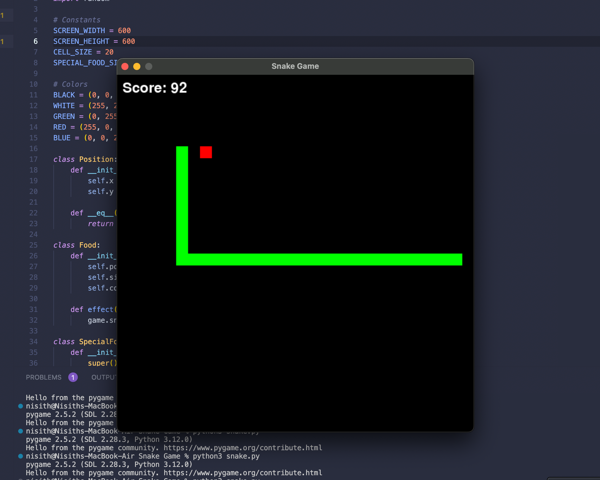

# SnakeGame-with-OOP  🐍

A classic Snake game implemented in Python using the Pygame library. This project serves as a mini-project to demonstrate Object-Oriented Programming (OOP) concepts. My main target of doing this mini project is to get a simple and practicle understading of OOP consepts.



## Features

- Move the snake using the arrow keys (W, A, S, D)
- Eat food to grow the snake
- Generate special food every time the score reaches a multiple of five
- Display the score and a "Game Over" message when the game ends

## OOP Concepts Demonstrated

### Classes and Objects

- **Class `Position`**: Represents the coordinates of a point on the game board.
- **Class `Food`**: Represents regular food.
- **Class `SpecialFood`**: Inherits from `Food` and represents special food.
- **Class `Snake`**: Represents the snake in the game.
- **Class `Game`**: Manages the game logic and state.

### Encapsulation

- The `Snake` class encapsulates attributes like `segments`, `direction`, and `grow_next_move`, and methods like `move()`, `grow()`, and `set_direction()`.
- The `Game` class encapsulates the game's state and logic, such as generating food, updating the game state, and checking for collisions.

### Inheritance

- The `SpecialFood` class inherits from the `Food` class and overrides the `effect` method to add extra functionality (increasing the score by 10).

### Polymorphism

- Both `Food` and `SpecialFood` have an `effect` method, but they behave differently:
  - `Food` only grows the snake.
  - `SpecialFood` grows the snake and increases the score.

### Abstraction

- The `Game` class abstracts the complexity of the game's mechanics, exposing only simple methods like `update()` and `render()`.

## Getting Started

### Prerequisites

- Python 3.x
- Pygame library

### Installing Pygame

You can install the Pygame library using pip:

```bash
pip install pygame
```

### Running the Game
Clone the repository and run the snake_game.py file:

```bash
git clone https://github.com/NisithDivantha/snake-game.git
cd SnakeGame-with-OOP
python snake.py
```
### Controls
- `W`: Move up
- `S`: Move down
- `A`: Move left
- `D`: Move right

### Acknowledgments
- This project is inspired by the classic Snake game.
- Special thanks to the Pygame community for their documentation and tutorials.

By breaking down the game into these classes and using these OOP principles, the code becomes more organized, modular, and easier to manage or extend. For example, you can easily add new types of food or modify the snake's behavior without altering the entire codebase.